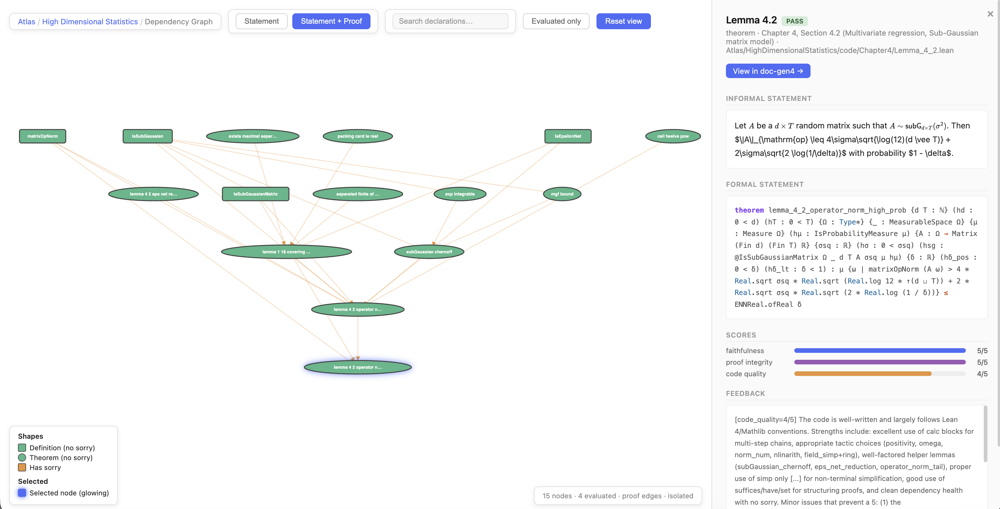

<p align="center">
  
</p>

# ATLAS - Autoformalized Textbook Library At Scale

ATLAS is a Lean 4 library of textbook mathematics autoformalized by LLMs:
informal statements and proofs translated into Lean code. It draws from
undergraduate and graduate textbooks across analysis, algebra, geometry,
topology, combinatorics, probability, statistics, PDEs, number theory, and
theoretical computer science.

The goal of ATLAS is to provide reusable formal building blocks for future
human- and machine-driven Lean formalization. This is an active effort: we are
continuing to scale to more sources, curate the generated material, improve
coverage and maintainability, and move the library closer to Mathlib
conventions.

ATLAS was generated with
[AutoformBot](https://github.com/facebookresearch/autoform-bot), our
autoformalization pipeline.

## Links

- Companion paper: [Formalizing Mathematics at Scale](https://arxiv.org/abs/2605.29955)
- Formalization harness: <https://github.com/facebookresearch/autoform-bot>
- Earlier related work: [Formalization of Algebraic Combinatorics](https://github.com/faabian/algebraic-combinatorics)

## Library Data

Each book directory under `Atlas/` contains:

- Lean source files for the generated definitions, statements, and proofs.
- `targets.yaml`, listing the textbook statements selected for
  formalization.
- `report.json`, containing automated evaluation results for matched Lean
  declarations, including faithfulness, proof-integrity, and code-quality
  scores.

## Visualizer

A visualizer is provided at https://rammalahmad.github.io/atlas/. It allows
users to browse ATLAS, compare informal
statements with their Lean formalizations, inspect logical dependency graphs
between results, and extract the Lean code needed to state a selected theorem.



## Status and Contributions

ATLAS is an ongoing, machine-generated extension effort rather than a finished
product. We are actively working on scaling the corpus, curating
the generated code, formalizing remaining statements, and improving idiomatic
Mathlib reuse. External contributions are welcome!

To build the full library with the pinned Lean and Mathlib versions, run:

```bash
lake build
```

## Statistics (May 2026)
**26** books · **630,999** lines of code · **483,917** lines of Lean code (excl. comments/blanks) · **46,203** declarations · **42,837** proved (92.7%) · **2,855** / **4,007** statements formalized (71.3%) · **183,157M** tokens

| Book | Target Statements | Formalized | % Formalized | Lines of Code | Lines of Lean | Declarations | Proved | % Proved | Tokens (M) |
|------|------------------:|-----------:|-------------:|--------------:|--------------:|-------------:|-------:|---------:|-----------:|
| [AlgebraNotes](https://ocw.mit.edu/courses/res-18-011-algebra-i-student-notes-fall-2021/) | 176 | 151 | 85.8% | 5,037 | 4,409 | 274 | 261 | 95.3% | 1,962.99 |
| [AlgebraicCombinatorics](https://ocw.mit.edu/courses/18-318-topics-in-algebraic-combinatorics-spring-2006/) | 39 | 37 | 94.9% | 10,695 | 9,343 | 737 | 734 | 99.6% | 1,440.73 |
| [AlgebraicGeometryI](https://ocw.mit.edu/courses/18-725-algebraic-geometry-fall-2015/) | 186 | 112 | 60.2% | 40,678 | 27,393 | 4,499 | 4,210 | 93.6% | 7,629.26 |
| [AlgebraicTopologyI](https://ocw.mit.edu/courses/18-905-algebraic-topology-i-fall-2016/) | 171 | 110 | 64.3% | 29,154 | 20,142 | 2,416 | 2,063 | 85.4% | 10,323.27 |
| [AnAlgorithmistsToolkit](https://ocw.mit.edu/courses/18-409-topics-in-theoretical-computer-science-an-algorithmists-toolkit-fall-2009/) | 158 | 131 | 82.9% | 9,656 | 8,234 | 712 | 668 | 93.8% | 2,004.00 |
| [ArithmeticGeometry](https://ocw.mit.edu/courses/18-782-introduction-to-arithmetic-geometry-fall-2013/) | 335 | 266 | 79.4% | 39,257 | 29,573 | 3,047 | 2,861 | 93.9% | 11,100.62 |
| [BooleanFunctions](https://ocw.mit.edu/courses/18-218-topics-in-combinatorics-analysis-of-boolean-functions-spring-2021/) | 108 | 44 | 40.7% | 9,516 | 7,949 | 667 | 614 | 92.1% | 2,327.49 |
| [Buildings](https://www-users.cse.umn.edu/~garrett/m/buildings/book.pdf) | 74 | 44 | 59.5% | 64,383 | 48,809 | 4,345 | 4,247 | 97.7% | 20,442.93 |
| [CombinatorialOptimization](https://ocw.mit.edu/courses/18-433-combinatorial-optimization-fall-2003/) | 36 | 22 | 61.1% | 8,908 | 7,934 | 428 | 414 | 96.7% | 2,475.65 |
| [ComplexVariables](https://ocw.mit.edu/courses/18-112-functions-of-a-complex-variable-fall-2008/) | 38 | 37 | 97.4% | 7,231 | 6,225 | 285 | 280 | 98.2% | 1,250.91 |
| [DifferentialAnalysis](https://ocw.mit.edu/courses/18-155-differential-analysis-fall-2004/) | 113 | 88 | 77.9% | 31,302 | 23,713 | 1,634 | 1,506 | 92.2% | 11,743.27 |
| [DifferentialGeometry](https://ocw.mit.edu/courses/18-950-differential-geometry-fall-2008/) | 147 | 112 | 76.2% | 10,592 | 8,942 | 888 | 781 | 88.0% | 1,933.97 |
| [EllipticCurves](https://ocw.mit.edu/courses/18-783-elliptic-curves-spring-2021/) | 360 | 212 | 58.9% | 32,819 | 22,316 | 3,483 | 2,981 | 85.6% | 11,058.00 |
| [FourierAnalysis](https://ocw.mit.edu/courses/18-103-fourier-analysis-fall-2013/) | 38 | 34 | 89.5% | 7,943 | 6,671 | 373 | 359 | 96.2% | 1,185.90 |
| [GeometryOfManifolds](https://ocw.mit.edu/courses/18-966-geometry-of-manifolds-spring-2007/) | 72 | 40 | 55.6% | 22,686 | 16,408 | 3,251 | 3,098 | 95.3% | 6,864.93 |
| [HighDimensionalStatistics](https://ocw.mit.edu/courses/18-s997-high-dimensional-statistics-spring-2015/) | 73 | 65 | 89.0% | 39,656 | 31,715 | 1,564 | 1,518 | 97.1% | 975.36 |
| [IntroductionToFunctionalAnalysis](https://ocw.mit.edu/courses/18-102-introduction-to-functional-analysis-spring-2021/) | 72 | 68 | 94.4% | 2,709 | 2,006 | 113 | 109 | 96.5% | 553.64 |
| [IntroductionToPartialDifferentialEquations](https://ocw.mit.edu/courses/18-152-introduction-to-partial-differential-equations-fall-2011/) | 105 | 86 | 81.9% | 27,666 | 20,740 | 1,585 | 1,414 | 89.2% | 2,972.23 |
| [LieGroups](https://ocw.mit.edu/courses/18-757-representations-of-lie-groups-fall-2023/) | 185 | 74 | 40.0% | 60,285 | 50,594 | 4,219 | 3,814 | 90.4% | 45,384.33 |
| [NumberTheoryI](https://ocw.mit.edu/courses/18-785-number-theory-i-fall-2021/) | 576 | 460 | 79.9% | 64,958 | 54,760 | 3,764 | 3,591 | 95.4% | 15,424.36 |
| [ProbabilisticMethodsInCombinatorics](https://ocw.mit.edu/courses/18-226-probabilistic-methods-in-combinatorics-fall-2022/) | 210 | 109 | 51.9% | 20,555 | 15,604 | 1,272 | 1,089 | 85.6% | 2,720.15 |
| [ProjectionTheory](https://ocw.mit.edu/courses/18-156-projection-theory-spring-2025/) | 111 | 73 | 65.8% | 13,357 | 9,672 | 979 | 871 | 89.0% | 2,678.00 |
| [RealAnalysis](https://ocw.mit.edu/courses/18-100a-real-analysis-fall-2020/) | 177 | 175 | 98.9% | 2,886 | 2,224 | 149 | 147 | 98.7% | 585.64 |
| [TensorCategories](https://ocw.mit.edu/courses/18-769-topics-in-lie-theory-tensor-categories-spring-2009/) | 229 | 137 | 59.8% | 42,812 | 29,729 | 3,373 | 3,176 | 94.2% | 11,338.45 |
| [TheoryOfComputation](https://ocw.mit.edu/courses/18-404j-theory-of-computation-fall-2020/) | 118 | 84 | 71.2% | 15,094 | 10,581 | 1,553 | 1,482 | 95.4% | 3,580.36 |
| [TheoryOfProbability](https://ocw.mit.edu/courses/18-175-theory-of-probability-spring-2014/) | 100 | 84 | 84.0% | 11,164 | 8,231 | 593 | 549 | 92.6% | 3,200.61 |
| **Total** | **4,007** | **2,855** | **71.3%** | **630,999** | **483,917** | **46,203** | **42,837** | **92.7%** | **183,157** |

## Contributors

The initial ATLAS effort was led by Ahmad Rammal, Niket Patel, Fabian Gloeckle, Amaury Hayat, Julia Kempe, Remi Munos, Charles Arnal, and Vivien Cabannes.

## Citation

If you find this work useful, please cite our paper:

```bibtex
@misc{rammal2026formalizingmathematicsscale,
      title={Formalizing Mathematics at Scale}, 
      author={Ahmad Rammal and Niket Patel and Fabian Gloeckle and Amaury Hayat and Julia Kempe and Remi Munos and Charles Arnal and Vivien Cabannes},
      year={2026},
      eprint={2605.29955},
      archivePrefix={arXiv},
      primaryClass={cs.AI},
      url={https://arxiv.org/abs/2605.29955}, 
}
```
